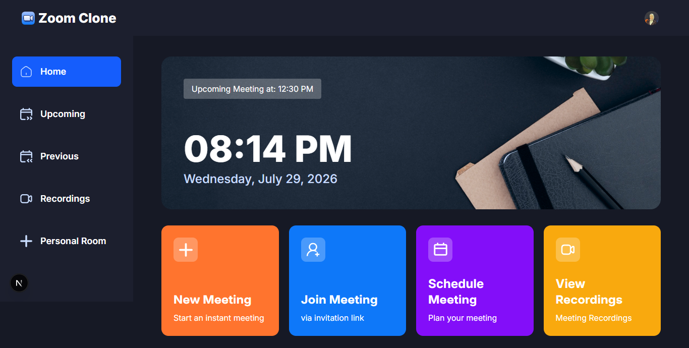
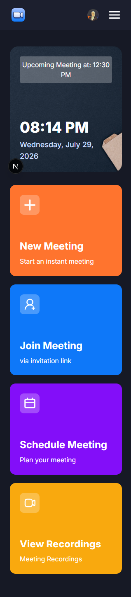
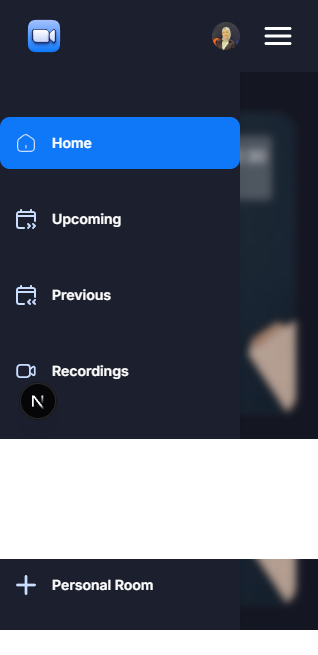

<p align="center">
  <a href="https://zoomclonap.netlify.app/" target="_blank">
    
  </a>
</p>

# 🎥 Zoom Clone

A modern full-stack Zoom Clone built with **Next.js 16**, **Stream Video SDK**, **Clerk Authentication**, **Tailwind CSS v4**, and **shadcn/ui**.

Users can securely authenticate, create instant or scheduled meetings, join meetings through invitation links, and manage upcoming meetings and recordings with a clean and responsive interface.

---

## ✨ Features

- 🔐 Authentication with Clerk
- 📹 Instant video meetings
- 📅 Schedule meetings
- 🔗 Join meetings via shared links
- 👥 Meeting setup (camera & microphone preview)
- 🎙 Toggle microphone and camera before joining
- 📂 Upcoming meetings
- 📼 Meeting recordings
- 🌙 Modern responsive UI
- ⚡ Server Actions
- 🔒 Secure Stream token generation

---

## 🛠 Tech Stack

### Frontend

- Next.js 16
- React 19
- TypeScript
- Tailwind CSS v4
- shadcn/ui
- Lucide React

### Authentication

- Clerk

### Video

- Stream Video SDK

### Deployment

- Netlify

---

## 📸 Screenshots







---

## ⚙️ Environment Variables

Create a `.env.local` file.

```env
# Clerk 
NEXT_PUBLIC_CLERK_PUBLISHABLE_KEY=pk_test_dWx0aW1hdGUta2FuZ2Fyb28tMTMuY2xlcmsuYWNjb3VudHMuZGV2JA
CLERK_SECRET_KEY=sk_test_blYazV05uslU49ISQbmMqsrCrWnG2o7YaXichYvKin

NEXT_PUBLIC_CLERK_SIGN_IN_URL=/sign-in
NEXT_PUBLIC_CLERK_SIGN_UP_URL=/sign-up

# Stream 
NEXT_PUBLIC_STREAM_API_KEY=tgjjuxqp89v6
STREAM_API_SECRET=6d8pf5nfpyxwth2pybjr6dj5h395e33w8f832p2wmektv26e8abuc5z5p77rx8er

NEXT_PUBLIC_BASE_URL=http://localhost:3000
```

---

## 🚀 Getting Started

Clone the repository

```bash
git clone https://github.com/Mai-Elhajeen/zoomclone.git
```

Move into the project

```bash
cd zoomclone
```

Install dependencies

```bash
npm install
```

Run the development server

```bash
npm run dev
```

Open

```
http://localhost:3000
```

---

## 📦 Build

```bash
npm run build
```

---

## 🚀 Deployment

This project is configured to be deployed on **Netlify**.

---

## 📈 Roadmap

- [x] Authentication
- [x] Stream Video Integration
- [x] Meeting Creation
- [x] Meeting Setup
- [x] Join Meeting
- [x] Upcoming Meetings
- [x] Recordings
- [x] Screen Sharing
---

## 👩🏼‍💻 Author
<p>
  <strong>Dev. Mai Elhajeen</strong><br><br>
  <a href="https://github.com/Mai-Elhajeen" target="_blank">
    GitHub
  </a>
  <br/>
  <a href="https://zoomclonap.netlify.app/" target="_blank">
    Live Demo
  </a>
</p>

---

## ⭐ Support

If you like this project, consider giving it a ⭐ on GitHub.
